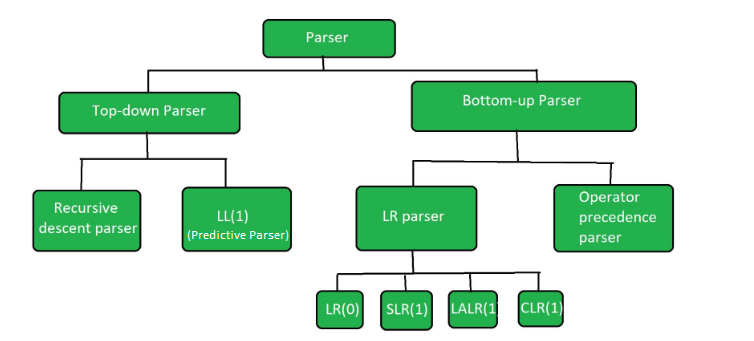
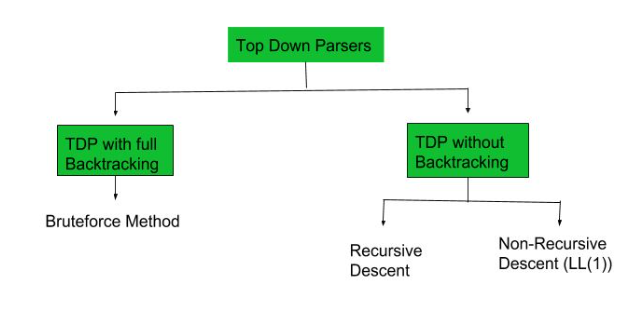
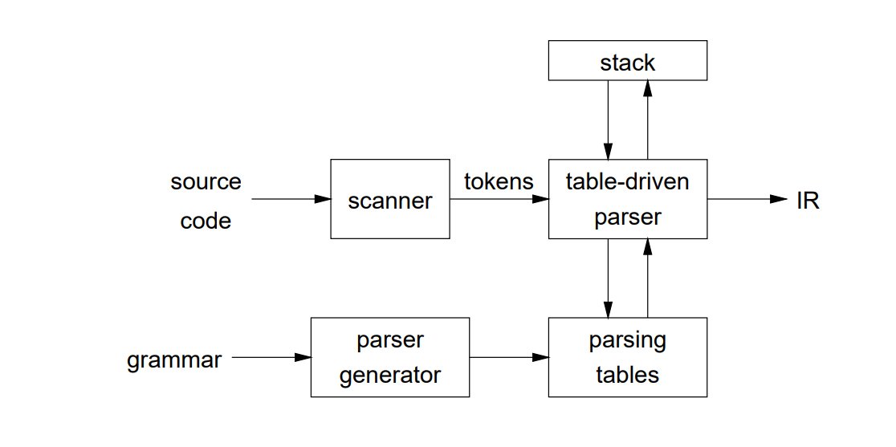
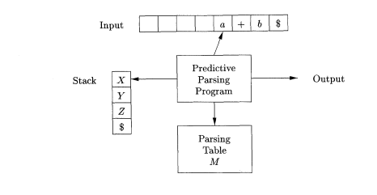
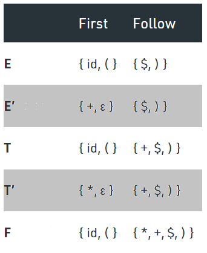
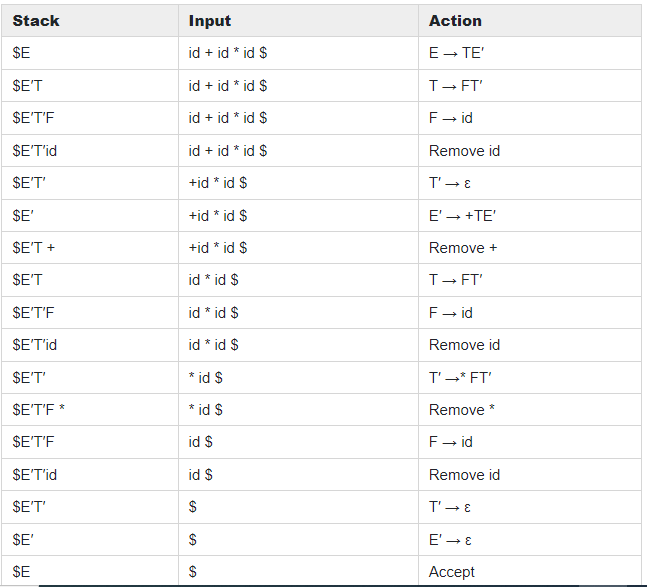
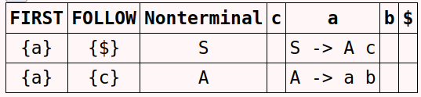
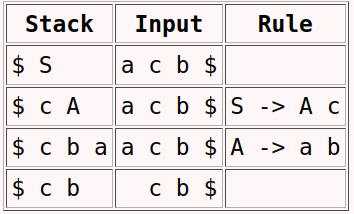

### Parser

Parser is the phase of compiler which takes a token string as input and with the help of existing grammar, converts it into the corresponding Intermediate Representation(IR). The parser is also known as Syntax Analyzer. Parser are divided into two Parts:
1) Top-down parser
2) Bottom-up parser

<center><p>Figure 2.1: Figure showing the classification of Parser.</p></center>

#### Top-Down parser

The top -down parser is the parser that generates parse for the given input string with the help of grammar productions by expanding the non-terminals i.e. it starts from the start symbol and ends on the terminals. It uses left most derivation.

Example:– Recursive descent Parser, Non-Recursive descent Parser (LL 1).

<center><p>Figure 2.2: Figure showing the classification of Top-down Parser.</p></center>

#### Bottom-Up parser

It is the parser that generates the parse tree for the given input string with the help of grammar productions by compressing the non-terminals i.e., it starts from non-terminals and ends on the start symbol.

Example:– LR Parser, Operator Precedence Parser

### Predictive Parser

Non–Recursive Descent Parser or LL (1) Parser is a top-down parser where backtracking is not used such that this can predict which products to use to replace the input string. It is a table-driven parser.

LL (1): where first L represents Left to Right scanning of inputs and second L represents left most derivation procedure and 1 represents for number of look ahead symbol. 

<center><p>Figure 2.3: The working of Table-driven parser or Predictive Parer.</p></center>

##### Essential Conditions to check first for LL(1) grammar


1) The grammar is free from left recursion.
2) grammar should not be ambiguous.
3) The grammar has to be left factored in so that the grammar is deterministic grammar.

These are necessary but not sufficient condition to check whether LL(1) Parser can be constructed for given grammar or not.

Predictive Parsing is done using a table, so to draw the table we have to find the First() and Follow() to avoid recursive calls. 

### First() of a grammar

`First(α)` is a set of terminal symbols that begin in strings derived from `α`.

For example: `A -> a b c | d e f | g h i`.
Then, `First(A)` is `{a,d,g}`


#### Rules for calculating **First()**:

1) For a production rule `X -> ε`: `First(X) = {ε}`
2) For any terminal symbol `a`: `First(a) = {a}`
3) For any production `X -> Y1 Y2 Y3`,
    If **ε** does not belong to `First(Y1)`, then `First(X) = First(Y1)`
    If **ε** belongs to `First(Y1)`, then `First(X) = {First(Y1) – ε } ∪ First(Y2 Y3)`

For Calculating, `First(Y2 Y3)` follow the steps of Rule 3.

### Follow() of a grammar

`Follow(α)` is a set of terminal symbols that appear immediately to the right of `α`.


#### Rules for calculating **Follow()** of a grammar

1) For the start symbol `S`, place `$` in `Follow(S)`.
2) For any production rule `A → α B`, `Follow(B) = Follow(A)`.
3) any production rule `A → α B β`,
    If `ε ∉ First(β)`, then `Follow(B) = First(β)`
    If `ε ∈ First(β)`, then `Follow(B) = {First(β) – ε } ∪ Follow(A)`


### Construction of LL(1) Parsing Table

After finding the **First()** and **Follow()**, then make a table such that row contain Non-terminal symbol and column contain the terminal symbol. Their will be an additional column of **$** symbol along with terminals.

#### Method:

Find `First(α)` and for each terminal in `First(α)`, make entry `A –> α` in the table.
If `First(α)` contains **ε** (epsilon) as terminal, find the **Follow(A)** and for each terminal in **Follow(A)**, make entry `A –> ε` in the table.

#### Table-driven Predictive Parsing

**INPUT**: A string `w` and a parsing table `M` for grammar `G`.

**OUTPUT**: If `w` is in `L(G)`, a leftmost derivation of `w`; otherwise, an error indication.

<center><p>Figure 2.4: Model of table-driven Predictive Parser.</p></center>

**METHOD**: Initially, the parser is in a configuration with `w$` in the input buffer and the start symbol `S` of `G` on top of the stack, above `$`. The program in Fig. 2.4 uses the predictive parsing table `M` to produce a predictive parse for the input.

```

set ip to point to the first symbol of w;
set X to the top stack symbol;
while ( X != $ ) { /* stack is not empty */
    if ( X is a ) pop the stack and advance ip;
    else if ( X is a terminal ) error();
    else if ( M[X, a] is an error entry ) error();
    else if ( M[X,a] = X -> Y1Y2 Yk ) {
        output the production X -> YlY2....Yk;
        pop the stack;
        push Yk, Yk-1,. . . , Yl onto the stack, with Yl on top;
    }
    set X to the top stack symbol;
}

```

#### Example 1

Consider the Grammar:

```

E  -> T E'
E' -> + T E' | ε
T  -> F T'
T' -> * F T' | ε
F  -> id | ( E )

```

The grammar satisfies all the necessary condition mentioned above.
We will calculate **First()** and **Follow()** of the grammar first: 

<center><p>Figure 2.5: First and Follow for each non-terminal of the given Grammar. </p></center>

Now we will make the parsing table:

<center><p>Figure 2.6: LL(1) Parser Table for the given grammar.</p></center>

Checking Acceptance of String `id + id * id` using Predictive Parsing Program. Initially, the stack will contain the starting symbol `E` and `$` at the bottom of the stack. Input Buffer will contain a string attached with $ at the right end. If the top of stack = Current Input Symbol, then symbol from the top of the stack will be popped, and also input pointer advances or reads next symbol.

##### Sequence of Moves by Predictive Parser:

<center><p>Figure 2.7: Moves made by Predictive Parser on input id + id * id.</p></center>

#### Example 2

Consider the Grammar:

```

S -> A c
A -> a b

```

Parser table for the above grammar is:

<center><p>Figure 2.8: LL(1) parser table including First and Follow for each non-terminal of the given Grammar.</p></center>

Checking Acceptance of String "acb" using Predictive Parsing Program:

<center><p>Figure 2.9: Moves made by Predictive Parser on input "acb".</p></center>

We can see that for the above grammar when the input string is “acb” is given then stack is not empty at last so that means the string is not from that grammar. 


