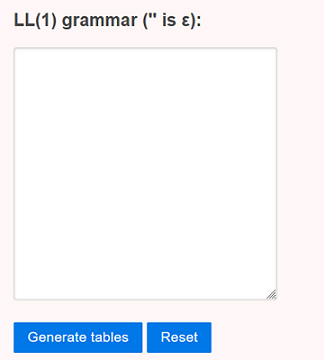
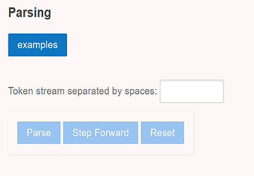

### Procedure

1) The simulator is as shown in figure 3.1.
   

Figure 3.1: Figure shows the simulator where user have to enter the Grammar.

2) Write each production rule in a separate line.

3) Separate each token using whitespace

4) **$** is reserved as the end-of-input symbol, and **S** is reserved as an artificial start symbol. The grammar is automatically augmented with the rule `S -> start $`

5) Use `''` for **ε**

6) Click `Generate Parse Table` button to See Results

7) To analyse Predictive Parsing of a string enter the string in the box as shown below in figure 3.2 and click on `Parse` button.
   

Figure 3.2: Figure shows the simulator where user have to enter an string to analyse the Predictive parsing of it.

8) The parsing of the input string will be done step-by step so Constantly Press `Step Forward` button to see the remaining steps.

9) Use `Examples` button to view valid and invalid string examples for ETF Grammar.

10) Use `Reset` button to reparse the string.
